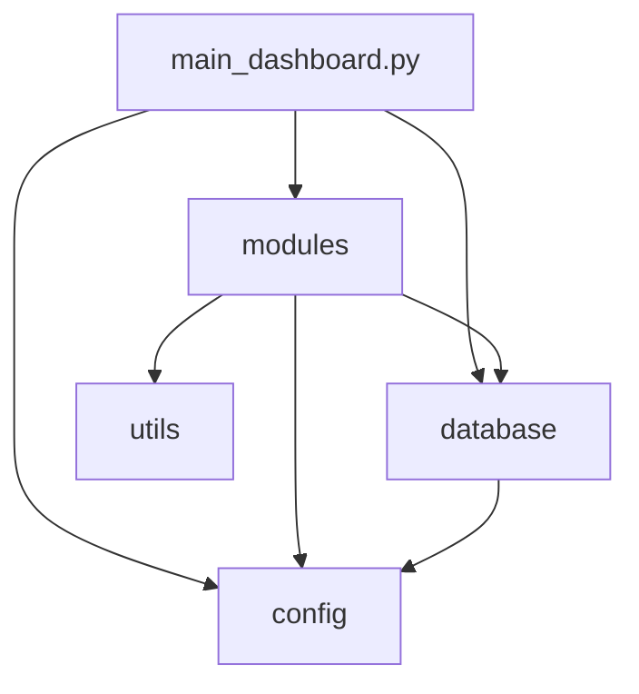

# HDFC Dashboard - Project Structure Documentation

## 📋 Overview

This document describes the reorganized project structure for the HDFC Analytics Dashboard. The project has been restructured to follow Python best practices with proper separation of concerns.

## 🗂️ Directory Structure

### Root Level
```
HDFC Dashboard/
├── main_dashboard.py          # Application entry point
├── README.md                  # Project documentation
├── requirements.txt           # Dependencies
├── .gitignore                 # Git ignore rules
└── .venv/                     # Virtual environment
```

### Configuration (`config/`)
Centralized configuration management:
```
config/
├── __init__.py               # Package initialization
├── app_config.py             # Application settings
│   ├── APP_TITLE, APP_ICON, PAGE_LAYOUT
│   ├── BANK_NAME, UNIQUE_ID_COL
│   ├── CAMPAIGN_COSTS
│   ├── FINAL_STATUS_MAP
│   ├── STATUS_COLORS
│   └── GOOGLE_SHEETS_URL
└── database_config.py        # Database configuration
    ├── DB_CONFIG (credentials)
    ├── TABLES (table names)
    └── get_connection_string()
```

**Usage:**
```python
from config import APP_TITLE, BANK_NAME, get_connection_string
```

### Modules (`modules/`)
Analysis and functional modules:
```
modules/
├── __init__.py               # Package initialization
├── HDFC_campaign.py          # Campaign performance analysis
│   └── render_campaign_analysis_module(df_mis, engine)
├── google_summary.py         # Google Ads analysis
│   └── render_google_ads_module(engine, df_mis)
├── status_analysis.py        # Final status analysis
│   └── render_status_analysis_module(df_mis, engine)
├── Input_MIS.py              # MIS data upload
│   └── render_mis_upload_module(engine)
├── phone_numbers.py          # Phone extraction
│   └── render_phone_numbers_module(engine, df_mis)
└── sql_console.py            # SQL interface
    └── render_sql_console_module(engine)
```

**Usage:**
```python
from modules import HDFC_campaign, status_analysis
status_analysis.render_status_analysis_module(df, engine)
```

### Database (`database/`)
Database connection and setup:
```
database/
├── __init__.py               # Package initialization
├── connection.py             # Connection manager
│   ├── get_db_engine()      # Cached connection
│   └── create_simple_engine() # Non-cached connection
└── setup_database.py         # Database initialization script
```

**Usage:**
```python
from database.connection import get_db_engine
engine, error = get_db_engine()
```

### Utilities (`utils/`)
Helper functions and utilities:
```
utils/
├── __init__.py               # Package initialization
├── date_utils.py             # Date parsing utilities
│   ├── parse_dates_safely()
│   └── find_date_column()
├── dataframe_utils.py        # DataFrame helpers
│   ├── find_column()
│   └── find_col()
└── optimize_images.py        # Image optimization
```

**Usage:**
```python
from utils.dataframe_utils import find_column
from utils.date_utils import parse_dates_safely
```

### Assets (`assets/`)
Static files and resources:
```
assets/
└── images/                   # Logos, banners, graphics
    ├── hdfc credit .png
    ├── HDFC-Credit-Cards.png
    └── HDFC campaign Analysis.png
```

### Documentation (`docs/`)
Project documentation:
```
docs/
├── PROJECT_STRUCTURE.md      # This file
├── SETUP_INSTRUCTIONS.md     # Setup guide
└── OPTIMIZATION_SUMMARY.md   # Performance notes
```

## 🔧 Key Changes from Old Structure

### Before Reorganization
```
HDFC Dashboard/
├── main_dashboard.py
├── HDFC_campaign.py
├── google_summary.py
├── status_analysis.py
├── Input_MIS.py
├── phone_numbers.py
├── sql_console.py
├── setup_database.py
├── optimize_images.py
└── Public/
```

### After Reorganization
- **Modular structure** with clear separation of concerns
- **Configuration management** centralized in `config/`
- **Database utilities** organized in `database/`
- **Helper functions** grouped in `utils/`
- **Static assets** moved to `assets/`
- **Documentation** centralized in `docs/`

## 📦 Import Changes

### Old Import Style
```python
import HDFC_campaign
import status_analysis
```

### New Import Style
```python
from modules import HDFC_campaign, status_analysis
from config import APP_TITLE, BANK_NAME
from database.connection import get_db_engine
from utils.dataframe_utils import find_column
```

## 🎯 Benefits

### 1. **Maintainability**
- Clear separation of concerns
- Easy to locate specific functionality
- Reduced file clutter in root directory

### 2. **Scalability**
- Easy to add new modules
- Configuration changes in one place
- Consistent import patterns

### 3. **Reusability**
- Utility functions can be easily reused
- Database connection logic centralized
- Configuration shared across modules

### 4. **Best Practices**
- Follows Python package structure conventions
- Proper use of `__init__.py` files
- Clear module boundaries

### 5. **Collaboration**
- Easier for new developers to understand
- Clear file organization
- Self-documenting structure

## 🚀 Running the Application

### Development
```bash
cd "/Users/venugopal/Desktop/Work/Projects/HDFC/HDFC Dashboard"
streamlit run main_dashboard.py
```

### Production
Configure environment variables and use process manager:
```bash
export DB_PASSWORD="your_password"
streamlit run main_dashboard.py --server.port 8501
```

## 📝 Configuration Management

### Database Configuration
Edit `config/database_config.py`:
```python
DB_CONFIG = {
    "username": "postgres",
    "password": "112406",
    "host": "localhost",
    "port": "5432",
    "database": "Nxtify"
}
```

### Application Configuration
Edit `config/app_config.py`:
```python
APP_TITLE = "HDFC Dashboard"
BANK_NAME = "HDFC"
CAMPAIGN_COSTS = {...}
```

## 🔐 Security Considerations

### Sensitive Data
- Database credentials in `config/database_config.py`
- Consider using environment variables for production
- Create `config/secrets.py` for sensitive data (gitignored)

### Git Ignore
Updated `.gitignore` includes:
- `config/secrets.py`
- `*.env` files
- Database files
- Cache directories

## 🧪 Testing Structure (Future)
```
tests/
├── __init__.py
├── test_modules/
├── test_utils/
└── test_database/
```

## 📊 Module Dependencies



## 🔄 Migration Checklist

- [x] Create directory structure
- [x] Move files to appropriate directories
- [x] Create `__init__.py` files
- [x] Create configuration files
- [x] Create utility modules
- [x] Update imports in main_dashboard.py
- [x] Update .gitignore
- [x] Create README.md
- [x] Create documentation
- [ ] Test all modules
- [ ] Update deployment scripts (if any)

## 📞 Support

For questions about the project structure:
1. Check this documentation
2. Review module-specific docstrings
3. Contact the development team

---

**Document Version**: 1.0
**Last Updated**: October 2025
**Author**: Development Team
